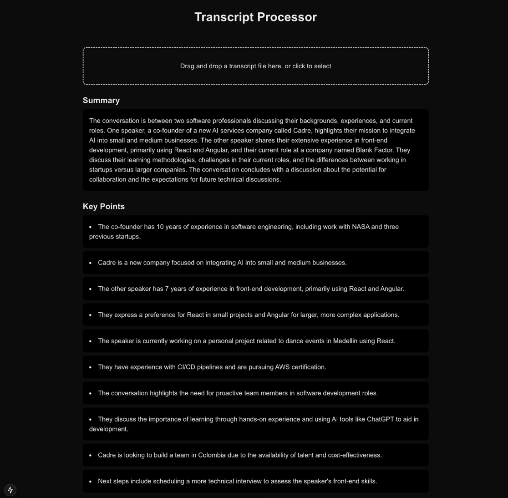

# Transcript Processing Application \- Project Description

## Overview

You'll be building a Next.js application that processes transcript files using OpenAI's API. Users can upload transcripts, and the application will generate summaries and key points.

## Core Requirements

### Frontend

- Drag-and-drop interface for transcript uploads  
- Display loading states during processing  
- Show generated summary and key points  
- Handle errors with user feedback  
- Responsive design using Tailwind CSS

### Backend

- Process uploaded transcripts using Next.js API routes  
- Integrate with OpenAI's API  
- Return structured data (summary and key points)  
- Implement error handling

## Getting Started

1. Create new Next.js project:

```
npx create-next-app@latest transcript-processor
```

Select the following options:

- TypeScript: Yes  
- ESLint: Yes  
- Tailwind CSS: Yes  
- src/ directory: Yes  
- App Router: Yes  
- Import alias: No  
2. Install dependencies:

```
cd transcript-processor
npm install react-dropzone openai axios
```

3. Set up environment variable: Create `.env.local` and add your OpenAI API key:

```
OPENAI_API_KEY=
```

## Resources

- Next.js Docs: [https://nextjs.org/docs](https://nextjs.org/docs)  
- OpenAI API: [https://platform.openai.com/docs/api-reference](https://platform.openai.com/docs/api-reference)  
- React Dropzone: [https://react-dropzone.js.org/](https://react-dropzone.js.org/)

## Time Allocation (35 minutes)

- Project setup: 5 minutes  
- API route implementation: 10 minutes  
- Frontend component: 15 minutes  
- Error handling and styling: 5 minutes

## Evaluation Criteria

- Clean, maintainable code  
- Proper error handling  
- Responsive design  
- API security  
- Component organization

## Bonus Points

- TypeScript type definitions  
- Loading states  
- Error boundary implementation  
- Rate limiting  
- Input validation

# Code Snippets

1. Calling OpenAI API

```
const response = await openai.chat.completions.create({
  model: "gpt-4o-mini",
  messages: [
    {
      role: "system",
      content: "Generate a summary and key points from the following transcript. Format the response as JSON with 'summary' and 'keyPoints' fields, where keyPoints is an array of strings."
    },
    {
      role: "user",
      content: transcript
    }
  ],
  temperature: 0.7,
  max_tokens: 500,
  response_format: { type: "json_object" }
});

// @ts-ignore
const result = response.choices[0].message.content;
return NextResponse.json(result);
```

# Sample UI

